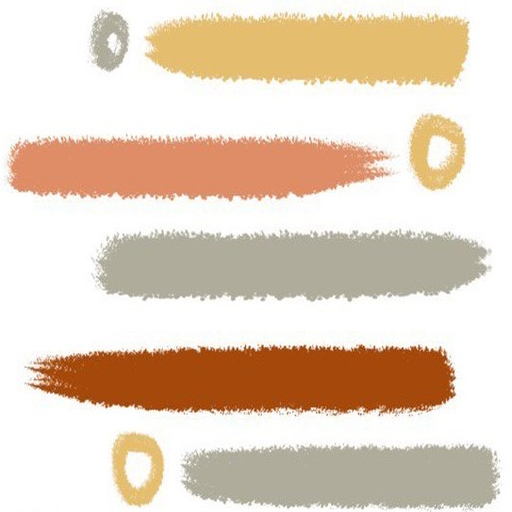

# News Whizz

It's and android app built with kotlin. Our app is a user-friendly news application that delivers the latest headlines and most talked-about news stories. It provides a convenient and personalized news browsing experience, keeping users informed and engaged. Stay updated with breaking news and explore a wide range of topics with our intuitive and easy-to-use interface.


## API Reference

#### Get all items

```http
  GET https://newsapi.org/v2/top-headlines?country=us&category=business&apiKey=684cb893caf7425abeffad82ac1d0f4e
```


## Features

- Online Registration
- Latest news headlines
- User Friendly
- Notified time to time 
- Light and quick


## News-Whiz App Demo Video
[


## Download
<a href="https://drive.google.com/file/d/1U4-5RmE0adpKsE2Zzr_8J9qtUjbSV8Gq/view">
  
</a>

[](https://drive.google.com/file/d/1U4-5RmE0adpKsE2Zzr_8J9qtUjbSV8Gq/view)


## Guide
[](https://docs.google.com/document/d/1EIi8dZ0EwxzcsCEcrDeg8fdUTvdXoeYgUMJVEVuFaPM/edit)

